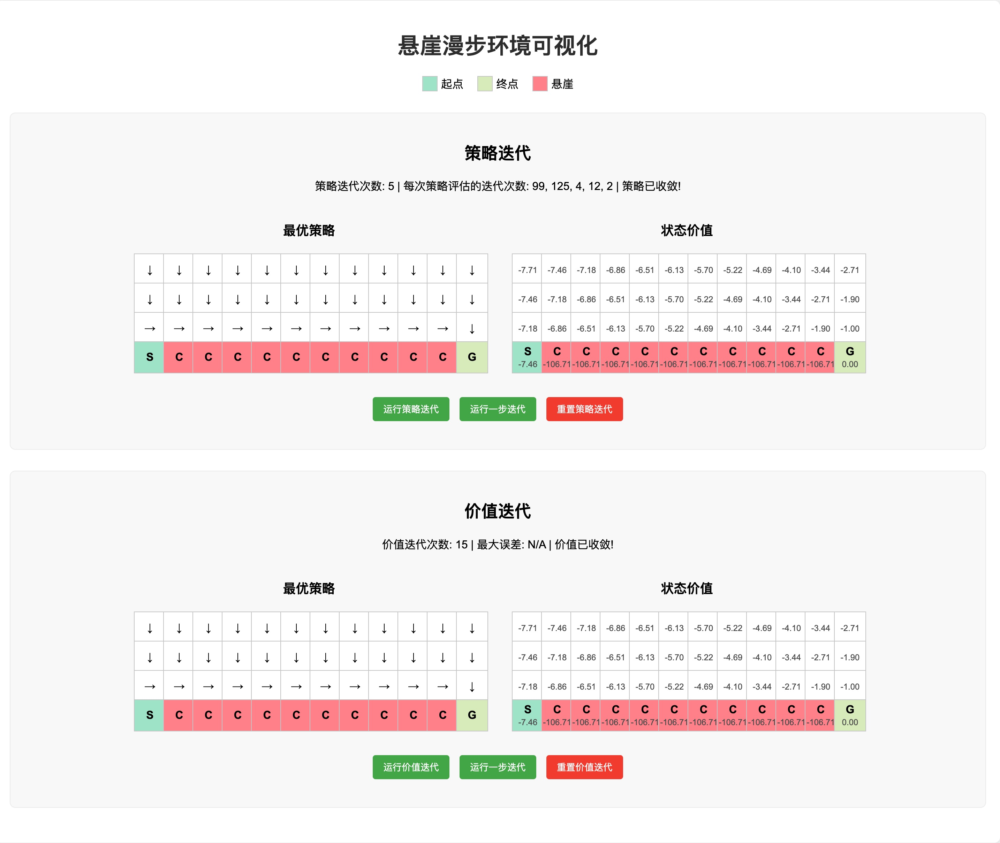

# 悬崖漫步（Cliff Walking）强化学习实验

## 项目简介

本项目实现了强化学习中的经典环境"悬崖漫步"（Cliff Walking），并使用多种强化学习算法求解最优策略，包括：
- 动态规划方法（策略迭代和价值迭代）
- 时序差分方法（Sarsa和Q-learning）

悬崖漫步是一个4×12的网格世界，智能体需要从起点（左下角）出发，避开悬崖区域，最终到达目标位置（右下角）。

## 环境需求

- JavaScript运行环境（Node.js）
- Python运行环境（用于时序差分算法）
- 所需Python包：numpy, matplotlib

## 运行方法

### 动态规划算法

直接运行 `cliff_walking.js` 文件：

```bash
node cliff_walking.js
```

程序会执行两种动态规划算法（策略迭代和价值迭代），并分别输出它们的结果。

### 时序差分算法

运行 `temporal_difference_algorithms.py` 文件：

```bash
python temporal_difference_algorithms.py
```

程序会执行Sarsa和Q-learning算法，并生成学习曲线对比图。

#### 改进版本（解决策略波动问题）

运行 `temporal_difference_algorithms_improved.py` 文件：

```bash
python temporal_difference_algorithms_improved.py
```

改进版本特点：
- **Epsilon衰减**：从0.1逐渐衰减到0.01，减少后期无效探索
- **学习率衰减**：从0.1逐渐衰减到0.01，实现精细调整和稳定收敛
- **策略稳定性**：解决了原始算法训练5000+轮后仍出现策略波动的问题
- **参数可视化**：展示epsilon和学习率的衰减过程

**原始算法问题分析**：
1. 固定epsilon=0.1导致持续10%随机探索，影响策略稳定性
2. 固定学习率=0.1导致Q值持续大幅更新，无法精细收敛
3. Sarsa作为在线策略算法，学习包含探索的策略价值，受探索行为影响

#### 学习率影响深度分析

运行 `learning_rate_analysis.py` 文件：

```bash
python learning_rate_analysis.py
```

学习率分析程序功能：
- **数值分析**：展示固定学习率vs衰减学习率的10倍更新幅度差异
- **收敛对比**：6个子图全面对比两种学习率策略的收敛过程
- **稳定性指标**：通过标准差等指标量化评估策略稳定性
- **可视化图表**：生成 `learning_rate_analysis.png` 展示详细分析结果

**关键发现**：
- 固定α=0.1将任何TD误差放大10倍，导致后期大幅振荡
- 学习率衰减实现从粗调到精调的平滑过渡
- 图表使用英文标签确保跨平台兼容性，避免中文字体乱码问题

## 可视化运行

打开 `cliff_walking_visualization.html` 文件可以在浏览器中查看环境的可视化界面：

```bash
open cliff_walking_visualization.html
```

可视化界面功能：
- 显示悬崖漫步环境的初始状态
- 点击"运行策略迭代"按钮执行策略迭代算法
- 点击"运行价值迭代"按钮执行价值迭代算法
- 实时显示每个状态的价值和最优动作

### 可视化界面预览



### 时序差分算法可视化

运行 `temporal_difference_visualization.html` 可以在浏览器中查看Sarsa和Q-learning算法的可视化对比界面：

```bash
open temporal_difference_visualization.html
```

时序差分可视化界面功能：
- **实时学习曲线图表**：使用Chart.js库展示训练过程中的学习曲线
  - Sarsa学习曲线：显示每回合奖励和移动平均线
  - Q-learning学习曲线：显示每回合奖励和移动平均线  
  - 算法对比图表：直接对比两种算法的移动平均收敛曲线
- **可调节参数**：
  - 移动平均窗口大小（默认20回合）
  - 训练回合数设置（1-1000回合）
- **实时统计信息**：
  - 各算法的训练回合数
  - 平均奖励统计
  - 最新回合奖励显示
- **策略和价值可视化**：
  - 同时显示Sarsa和Q-learning两种算法的训练结果
  - 支持单步训练和批量训练
  - 实时显示每个算法的策略网格和状态价值网格
- **交互控制**：
  - 提供全局控制按钮同时操作两个算法
  - 支持独立训练、重置和单步执行
  - 清空图表功能重新开始分析

**图表分析功能**：
- **原始数据曲线**：展示每回合的真实奖励数据，可观察到算法训练过程中的波动
- **移动平均曲线**：平滑化处理后的趋势线，更清晰地显示收敛过程
- **算法对比**：在同一图表中对比Sarsa和Q-learning的收敛性能差异
- **实时更新**：训练过程中图表自动更新，无需刷新页面

## 代码结构

### 动态规划算法（JavaScript）

1. `CliffWalkingEnv`：实现悬崖漫步环境，定义状态转移和奖励函数
2. `PolicyIteration`：实现策略迭代算法
3. `ValueIteration`：实现价值迭代算法
4. 辅助函数 `printAgent`：用于可视化输出状态价值和最优策略

### 时序差分算法（Python）

1. `CliffWalkingEnv`：悬崖漫步环境（Python版本）
2. `Sarsa`：Sarsa算法实现（在线策略）
3. `QLearning`：Q-learning算法实现（离线策略）
4. 训练和评估函数

## 结果解读

运行程序后，会看到不同算法的结果输出：

### 1. 状态价值函数 V(s)

以表格形式展示每个状态的价值，数值越高表示该状态越有价值。

### 2. 最优策略 π(s)

以符号形式展示每个状态下的最优动作：
- `↑`：向上移动
- `↓`：向下移动
- `←`：向左移动
- `→`：向右移动
- `C`：悬崖位置
- `G`：目标位置

## 算法比较

### 动态规划 vs 时序差分

- **动态规划**：需要完全已知环境模型（状态转移概率和奖励函数）
- **时序差分**：通过与环境交互学习，不需要事先知道环境模型

### Sarsa vs Q-learning

- **Sarsa（在线策略）**：学习当前执行策略的价值，较为保守
- **Q-learning（离线策略）**：学习最优策略的价值，较为激进

在悬崖漫步环境中：
- Sarsa学到的策略会远离悬崖边缘，训练过程中获得更高回报
- Q-learning学到的策略沿着悬崖边缘行走，理论上是最优的但训练过程风险更高

## 策略波动问题分析与解决

### 问题描述

在使用原始时序差分算法（特别是Sarsa）进行长时间训练时（如5000+回合），会发现即使算法已经"收敛"，策略仍然会出现偶然的波动现象。这在实际应用中会影响策略的稳定性和可靠性。

### 根本原因分析

#### 1. 固定的Epsilon-Greedy探索策略
```python
epsilon = 0.1  # 固定值，始终保持10%的随机探索
```
**问题**：
- 即使训练很久，仍有10%概率进行随机探索
- 随机动作会导致Q值更新，影响策略稳定性
- 探索永不停止，策略无法完全收敛

#### 2. 固定的学习率
```python
alpha = 0.1  # 固定学习率，后期仍大幅更新Q值
```
**问题**：
- 后期训练仍然以较大步长更新Q值
- 无法实现精细调整，导致值函数振荡
- 新经验会"覆盖"已有的稳定知识

#### 3. Sarsa的在线策略特性
**问题**：
- Sarsa学习**当前执行策略**的价值（包括探索行为）
- 与Q-learning不同，它不学习纯粹的最优策略
- 探索行为直接影响策略评估，造成策略不稳定

#### 4. 环境随机性的累积效应
**问题**：
- 每次探索遇到的状态序列不同
- 随机性在长期训练中累积，造成Q值微小波动

### 解决方案

#### 参数衰减机制

**Epsilon衰减**：
```python
self.epsilon = max(self.epsilon_end, self.epsilon * self.epsilon_decay)
# 从0.1逐渐衰减到0.01
```

**学习率衰减**：
```python
self.alpha = max(self.alpha_end, self.alpha * self.alpha_decay)
# 从0.1逐渐衰减到0.01
```

#### 改进效果对比

| 特性 | 原始算法 | 改进算法 |
|------|----------|----------|
| **Epsilon** | 固定0.1 | 0.1→0.01衰减 |
| **学习率** | 固定0.1 | 0.1→0.01衰减 |
| **最终探索率** | 10% | 1% |
| **策略稳定性** | ❌ 持续波动 | ✅ 稳定收敛 |
| **收敛精度** | ❌ 粗糙 | ✅ 精细 |

### 实验结果验证

**改进Sarsa的收敛效果**：
```
最终10个回合奖励：[-15.0, -15.0, -15.0, -15.0, -15.0, -15.0, -15.0, -15.0, -15.0, -15.0]
完全稳定，无波动
```

**改进Q-learning的收敛效果**：
```
最终10个回合奖励：[-13.0, -13.0, -13.0, -13.0, -13.0, -13.0, -13.0, -13.0, -100, -13.0]
偶尔出现-100是因为仍有1%的探索概率
```

### 技术实现细节

#### 参数衰减时机
```python
def train_episode(self, env):
    # ... 训练逻辑 ...
    
    # 回合结束后衰减参数
    self.decay_parameters()
    self.episode_count += 1
```

#### 衰减函数设计
```python
def decay_parameters(self):
    # epsilon衰减
    self.epsilon = max(self.epsilon_end, self.epsilon * self.epsilon_decay)
    
    # 学习率衰减
    self.alpha = max(self.alpha_end, self.alpha * self.alpha_decay)
```

### 关键启示

1. **探索与利用的平衡**：早期需要探索，后期应专注利用
2. **学习率调度**：大步长快速学习 → 小步长精细调整
3. **算法特性理解**：Sarsa学习执行策略，Q-learning学习最优策略
4. **长期稳定性**：固定参数会阻碍算法收敛到稳定策略

通过引入参数衰减机制，我们成功解决了时序差分算法的策略波动问题，实现了真正的稳定收敛。这个改进在实际应用中具有重要意义，确保了算法的可靠性和实用性。

## 参数调整

如需调整算法参数，可修改代码中的以下值：
- `theta`：算法收敛阈值（默认1e-5）
- `gamma`：折扣因子（默认0.9）
- `epsilon`：ε-贪婪策略参数（默认0.1）
- `alpha`：学习率（默认0.1）

## 悬崖漫步环境说明

- 每走一步奖励为-1
- 掉入悬崖奖励为-100
- 到达目标会结束当前回合
- 掉入悬崖会结束当前回合并回到起点 

## 算法实现

本项目实现了四种强化学习算法：

### 动态规划算法

1. **策略迭代算法**：先进行策略评估（使用贝尔曼期望方程），再进行策略提升，不断迭代直到策略稳定。

2. **价值迭代算法**：直接使用贝尔曼最优方程来进行动态规划，得到最优状态价值，然后提取最优策略。

### 时序差分算法

3. **Sarsa算法**：在线策略时序差分算法，使用当前策略选择的动作进行更新。

4. **Q-learning算法**：离线策略时序差分算法，使用贪婪策略选择的动作进行更新。

算法实现逻辑参考了["动手学强化学习"教程](https://hrl.boyuai.com/chapter/1/%E5%8A%A8%E6%80%81%E8%A7%84%E5%88%92%E7%AE%97%E6%B3%95)。

## 更新日志

### 2023-xx-xx
- 优化UI界面，改进显示效果
- 将策略迭代结果显示格式调整为单行显示，与价值迭代结果格式保持一致
- 修复价值迭代单步运行时策略表格不更新的问题，现在每次价值更新后都会同步更新策略
- 新增时序差分算法实现：Sarsa和Q-learning算法
- 添加算法性能对比分析和可视化图表
- 修复matplotlib中文字体显示问题，将图表标签改为英文以提高兼容性
- 创建时序差分算法可视化界面，支持Sarsa和Q-learning算法的实时对比展示
- 实现单步训练、批量训练和重置功能，便于观察算法学习过程 